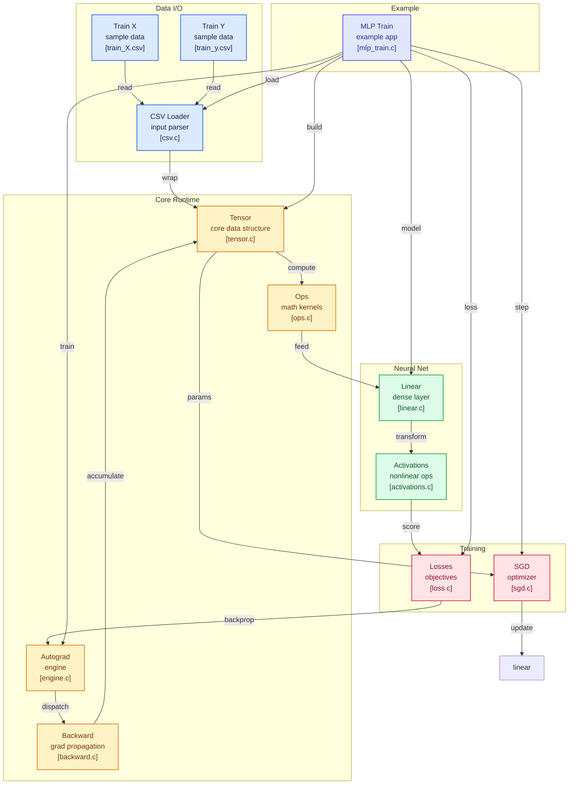

# CML
## machine learning in C because why not?

modern machine learning is conveniant but deeply opaque

you write 
```
loss.backward()
```

and trust that:
- gradients are correct

- memory is handled safely

- tensors are laid out efficently

- performance is "someone else's problem"

under the hood, that single line triggers:
- dynamic graph construction

- reverse mode automatic differentiation

- memory allocation and reuse

- kernel dispatch

- numerical edge cases you never see

most of the time it's great, until you actually want to **understand what's happening**

at some point abstractions stop helping and start hiding things
you read papers
you debug exploding gradients
you care about memory
you wonder why a model behaves the way it does

and the answer is usually "it's implimented in c/c++ somewhere inside the framework"

you open the source code and immmediately drown in massive codebases, GPU kernels and years of legacy abstractions!

understanding becomes harder than using


ML didn't start in python and didn't start in pytorch and certainly didn't start with one line APIs
at it's core it is just:
- linear algebra

- chain rule

- memory

so the questions came flowing:
- what if we removed the abstractions?

- what if we removed python?

- what if we build the whole thing in C?

not to be fast
not to be practical 
but to be honest

this decision became **CML**


## why does this exist?

most modern ML stacks look something like this:
```
C → CUDA → C++ → python → pytorch → your code
```
and then we call it a "high level AI"

so i asked
> if ML is already built on C anyway, why not cut the middle man?

**CML** became the answer

it isn't practical not fast and certainly not recommanded
it is however explicit, transparent and honest

## what is CML?

CML is a from-scratch ML framework written in pure C

no:
- pytorch
- tensorflow
- BLAS / LAPACK
- CUDA
- python
- external ML libraries

just:
- manual memory managment
- explicit linear algebra
- reverse mode automatic differentiation
- dynamic computation graphs
- consequences

## what CML actually impliments?

CML is intentionally small but **not trivial**

**CORE TENSOR SYSTEM:**
- N-dimensional tensors (float32)

- explicit shape and stride tracking

- contiguous memory layout

- tensor views (reshape / slice without copy)

- gradient buffers matching tensor shape

- reference-counted memory management

**AUTOMATIC DIFFERENTIATION:**
- reverse-mode autodiff (backpropagation)

- dynamic computation graphs

- each tensor tracks:

   - parent tensors

   - backward function pointer

- topological graph traversal during backward pass

- explicit gradient accumulation

no symbolic math, no magic
just graph construction and traversal

**MATHEMATICAL OPERATIONS:**
- elementwise ops: add, sub, mul

- matrix multiplication

- reduction ops (sum)

- broadcasting (limited, explicit)

- activation functions (Relu, sigmoid, tanh)

each operation:

- allocates a new tensor

- records its parents

- defines its own backward function

**NEURAL NETWORK LAYERS:**
- linear (dense) layers

- explicit parameter tensors (weights, bias)

- modular forward / backward logic

- gradient accumulation into parameters

and yes, this supports multi-layer perceptrons

**TRAINING UTILITIES:**
- loss functions:
    MSE
    BCE

- stochastic gradient descent

- mini batch training loop

- CSV dataset loader

yes, the loss actually decreases
no, it's nowhere fast

## what CML **deliberatly DOES NOT** do?

this is **NOT A PRODUCTION FRAMEWORK**, it's intentional

- no GPU support

- no CNNs/RNNs/transformers

- no BLAS/LAPACK

- no multithreading

- no checkpoints

- no python bindings

- no performance optimizations

if you want speed use **pytorch**

if you want comfort use **python**

and if you want to know what's really happening **keep reading**

## example usage
```
Tensor* x = tensor_randn(64, 10);
Tensor* y = model_forward(model, x);
Tensor* loss = mse(y, target);

tensor_backward(loss);
optimizer_step(opt);
```
it builds a computation graph
it backpropagates gradients

## want to give it a run?
```
gcc -o mlp_train examples/mlp_train.c tensor/tensor.c tensor/backward.c tensor/ops.c data/csv.c nn/linear.c nn/activations.c nn/loss.c optim/sgd.c autograd/engine.c -I. -Itensor -Idata -Inn -Ioptim -O2 -lm
```
then
```
./mlp_train.exe
```

## results

the network was trained on the XOR dataset (4 samples, 2 input features, 1 output)

below is a demonstration of the training progress over epochs with the cross-entropy loss decreasing as the network “learns”:


## MY design philosophy

explicit       > clever
readable       > optimized
correct        > fast
understandable > conveniance

every abstraction exists because it is necessary not because it is fashionable

## why C?
1. ML math is already implimented in C/C++

2. memory layout matters

3. abstractions leak

4. buidling things from scratch removes excuses

---

## diagram


---

> "you don't really understand something until you build it in C"
